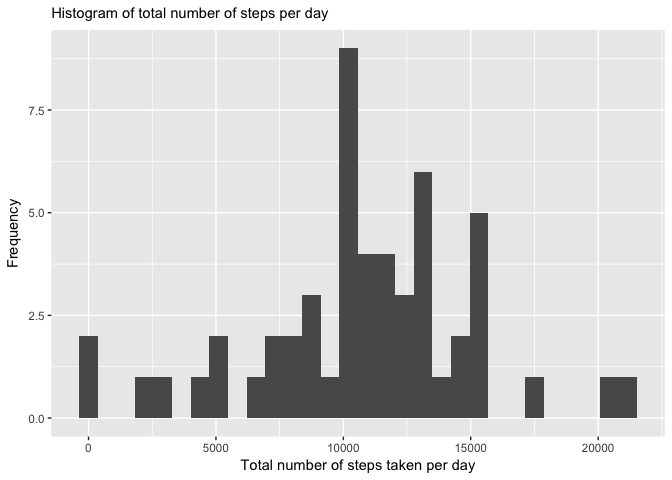
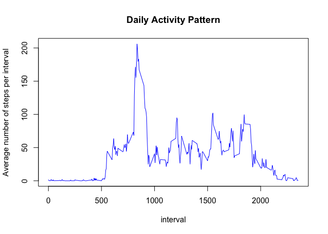
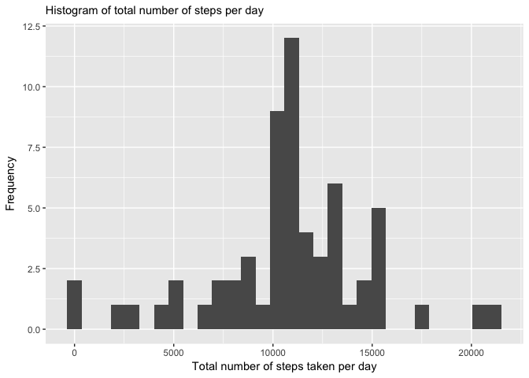
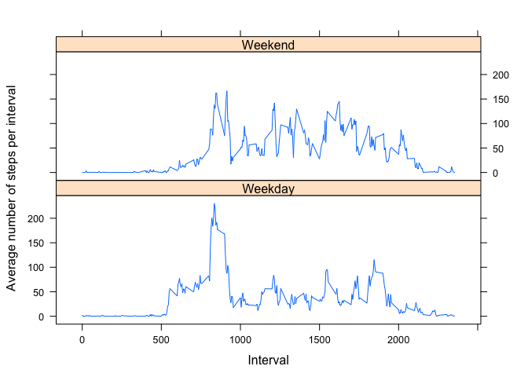

# Reproducible Research: Peer Assessment 1

Week 2, Peer Assessment 1 for Reproducible Research
====================

## Loading and preprocessing the data

1. Load the data

```r
activity <- read.csv("activity.csv")
```

Check the data
2. Process/transform the data (if necessary) into a format suitable for your analysis

```r
str(activity)
summary(activity) 
head(activity) 
tail(activity)
names(activity) 

# check whether the data frame inlcudes NAs
which(is.na(activity$steps)) # includes NAs
which(is.na(activity$date))
which(is.na(activity$interval))
```

## What is mean total number of steps taken per day?

1. Calculate the total number of steps taken per day

```r
# aggregate data for 'date' to get total number per day 
activity_date <- aggregate(activity$steps, by=list(activity$date), FUN=sum, na.exclude=TRUE)

# changing variable names that R produced via aggregate #
colnames(activity_date) <-cbind("DATE", "STEPS")

# get mean total number of steps per day
summary(activity_date) 
```

```
##          DATE        STEPS      
##  2012-10-01: 1   Min.   :   42  
##  2012-10-02: 1   1st Qu.: 8842  
##  2012-10-03: 1   Median :10766  
##  2012-10-04: 1   Mean   :10767  
##  2012-10-05: 1   3rd Qu.:13295  
##  2012-10-06: 1   Max.   :21195  
##  (Other)   :55   NA's   :8
```

2. Make a histogram of the total number of steps taken each day

```r
library(ggplot2)
histogram <- ggplot(activity_date, aes (STEPS)) +
    geom_histogram() + geom_histogram(binwidth=50) + 
    ggtitle ("Histogram of total number of steps per day") +
    xlab("Total number of steps taken per day") +
    ylab("Frequency") +
    theme(plot.title = element_text(size=11)) 
histogram
```

```
## `stat_bin()` using `bins = 30`. Pick better value with `binwidth`.
```

```
## Warning: Removed 8 rows containing non-finite values (stat_bin).

## Warning: Removed 8 rows containing non-finite values (stat_bin).
```

<!-- -->

3. Calculate and report the mean and median of the total number of steps taken per day

```r
summary(activity_date) 
```

```
##          DATE        STEPS      
##  2012-10-01: 1   Min.   :   42  
##  2012-10-02: 1   1st Qu.: 8842  
##  2012-10-03: 1   Median :10766  
##  2012-10-04: 1   Mean   :10767  
##  2012-10-05: 1   3rd Qu.:13295  
##  2012-10-06: 1   Max.   :21195  
##  (Other)   :55   NA's   :8
```
The mean of the total number of steps taken per day is 10767 and the median is 10766.

## What is the average daily activity pattern?

1. Make a time series plot (i.e. 𝚝𝚢𝚙𝚎 = "𝚕") of the 5-minute interval (x-axis) and the average number of steps taken, averaged across all days (y-axis)

```r
# aggregate data for steps and intervals
interval_data <- aggregate(activity$steps, by=list(activity$interval), FUN=mean, na.rm = TRUE)
colnames(interval_data) <-cbind("intervals", "steps")

# time series plot
plot(interval_data, type="l", xlab="interval", ylab="Average number of steps per interval", main="Daily Activity Pattern", col="blue")
```

<!-- -->

2. Which 5-minute interval, on average across all the days in the dataset, contains the maximum number of steps?


```r
# find max of steps
max(interval_data$steps)
```

```
## [1] 206.1698
```

```r
# find which interval has max number of steps
which.max(interval_data$steps)
```

```
## [1] 104
```
The maximum number of steps is 206, during the 104's interval (835). 

## Imputing missing values

1. Calculate and report the total number of missing values in the dataset (i.e. the total number of rows with 𝙽𝙰s)

```r
which(is.na(activity$steps)) # includes NAs
which(is.na(activity$date)) # no NAs
which(is.na(activity$interval)) # no NAs

# Calculate how many NA values are in the steps column 
sum(is.na(activity$steps))

missing_data <- which(is.na(activity))
print(length(missing_data))
```
There are 2304 rows (intervals) with missing data for steps. 

2. Devise a strategy for filling in all of the missing values in the dataset. The strategy does not need to be sophisticated. For example, you could use the mean/median for that day, or the mean for that 5-minute interval, etc.


```r
# mean for the 5-minute interval

new_dataset <- activity
for(i in 1:length(missing_data)){
    new_dataset[missing_data[i], 1] <- interval_data[interval_data$interval ==
                                   new_dataset[missing_data[i],]$interval,]$steps
}

# check whether new dataset has NAs
which(is.na(new_dataset$steps)) # no NAs
```

```
## integer(0)
```


4. Make a histogram of the total number of steps taken each day and Calculate and report the mean and median total number of steps taken per day. Do these values differ from the estimates from the first part of the assignment? What is the impact of imputing missing data on the estimates of the total daily number of steps?


```r
# aggregate data for 'date' to get total number of steps per day for the new dataset
new_dataset_date <- aggregate(new_dataset$steps, by=list(new_dataset$date), FUN=sum)

# changing variable names that R produced via aggregate #
colnames(new_dataset_date) <-cbind("DATE", "STEPS")

# get mean and median of total number of steps taken per day. 
summary(new_dataset_date) 
```

```
##          DATE        STEPS      
##  2012-10-01: 1   Min.   :   41  
##  2012-10-02: 1   1st Qu.: 9819  
##  2012-10-03: 1   Median :10766  
##  2012-10-04: 1   Mean   :10766  
##  2012-10-05: 1   3rd Qu.:12811  
##  2012-10-06: 1   Max.   :21194  
##  (Other)   :55
```

```r
# histogram of total number of steps taken each day for new dataset
histogram <- ggplot(new_dataset_date, aes (STEPS)) +
    geom_histogram() + geom_histogram(binwidth=50) + 
    ggtitle ("Histogram of total number of steps per day") +
    xlab("Total number of steps taken per day") +
    ylab("Frequency") +
    theme(plot.title = element_text(size=11)) 
histogram
```

```
## `stat_bin()` using `bins = 30`. Pick better value with `binwidth`.
```

<!-- -->
Both the mean and median of the total number of steps taken per day for the dataset with substituted missing values are 10767.

There is no difference in mean/median compared to the dataset including missing values. Imputing missing data had no impact on the estimates of the total number of steps. 

## Are there differences in activity patterns between weekdays and weekends?

1. Create a new factor variable in the dataset with two levels – “weekday” and “weekend” indicating whether a given date is a weekday or weekend day.

𝚠𝚎𝚎𝚔𝚍𝚊𝚢𝚜() function

```r
# create new variable with weekdays() function (creates a weekday out of a date)
new_dataset$weekday <- weekdays(as.Date(new_dataset$date))

# function that assign "weekend"" vs "weekday", creating a new variable "day"
day <- function(weekday){
    if(weekday %in% c("Saturday", "Sunday")){
        return("Weekend")
    }
    else{
        return("Weekday")
    }
}

new_dataset$day <- factor(sapply(X = new_dataset$weekday, FUN = day))
```

2. Make a panel plot containing a time series plot (i.e. 𝚝𝚢𝚙𝚎 = "𝚕") of the 5-minute interval (x-axis) and the average number of steps taken, averaged across all weekday days or weekend days (y-axis). See the README file in the GitHub repository to see an example of what this plot should look like using simulated data.


```r
# aggregate data for steps and intervals
interval_new_dataset <- aggregate(new_dataset$steps, by=list(new_dataset$interval, new_dataset$day), FUN=mean)
colnames(interval_new_dataset) <-cbind("intervals","day", "steps")

# time series plot
library(lattice)
xyplot(interval_new_dataset$steps ~ interval_new_dataset$interval | interval_new_dataset$day, 
       layout = c(1, 2), type = "l", 
       xlab = "Interval", ylab = "Average number of steps per interval")
```

<!-- -->

